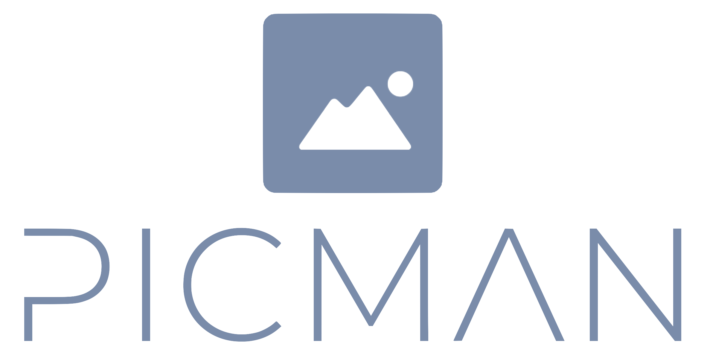
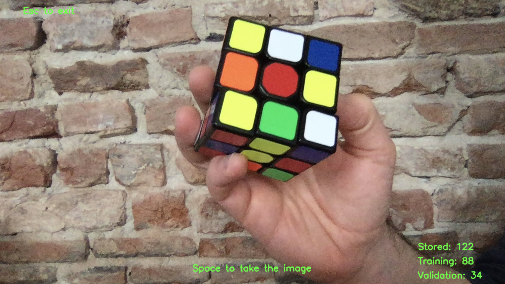

\
Picman is a Python3 based tool that will help you to easily populate training and validation sets of raw images, 
taken from your video device.   
 
## Requirements
* numpy >= 1.20.0
* argparse >= 1.4.0
* opencv-python >= 4.5.1.48

## Run
Run:
```shell script
python3 picman.py -d path_to_destination [- n img_basename] [-s size_trainingset]
```

args:
 * ```-d```, the path to the base destination folder, in which images will be stored;
 * ```[-n]```, the base name of images, 'img' by default;
 * ```[-s]```, the size of the training over the entire dataset in decimal number, 0.7 by default.    

For example, by running:
```shell script
python3 picman.py -d dataset - n img -s 0.8
```
It will create a dataset of images named `img-1`, `img-2`, and so on.
About the 80% of the images you take will be stored in `dataset/training/images`, 
and the rest of the images in `dataset/validation/images`.

## Usage
The image below shows the building of a dataset of Rubik's cube images. 

The GUI continuously shows the image captured by the video device.
On top of the current image, the GUI shows the following information:
 - the commands (space bar for capturing a new image, esc for quitting);
 - the number of images stored and the current size of the training and validation sets.



## Contributing
Please read our [contributing instructions](CONTRIBUTING.md) and our [code of conduct](CODE_OF_CONDUCT.md),
for details on the process of submitting requests to us.

## Versioning
We use [SemVer](https://semver.org/) for versioning. For the versions available, see the tags on this repository.

## License
This project is licensed under the MIT License - see the [LICENSE](LICENSE) for details.

## Author
Francesco Racciatti
